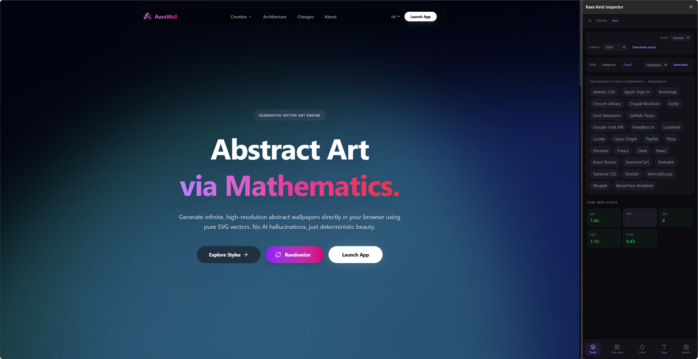
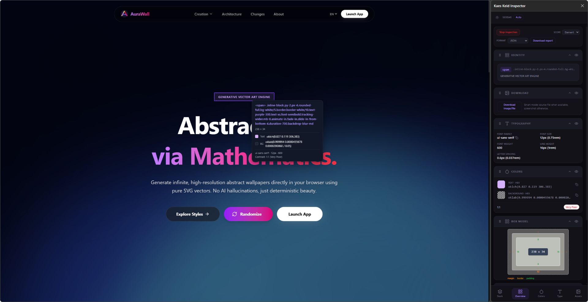
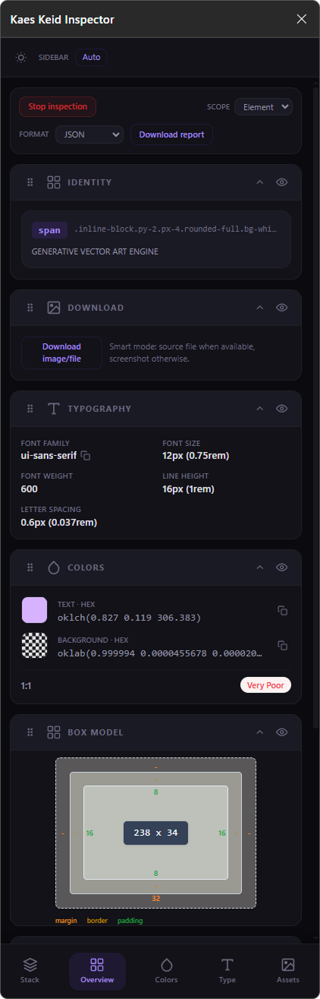
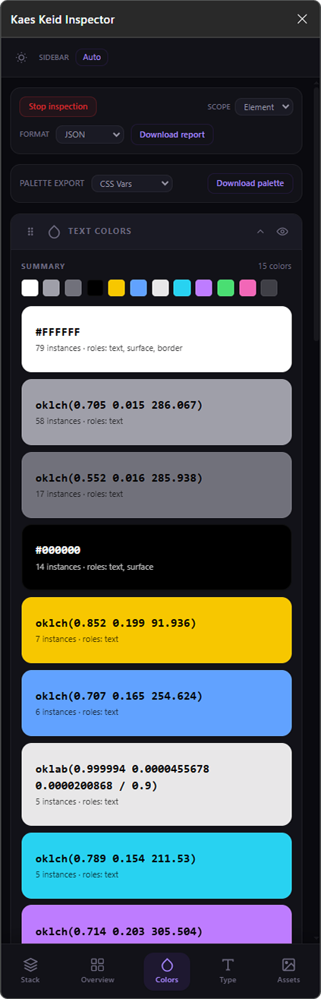
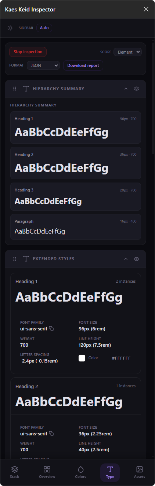
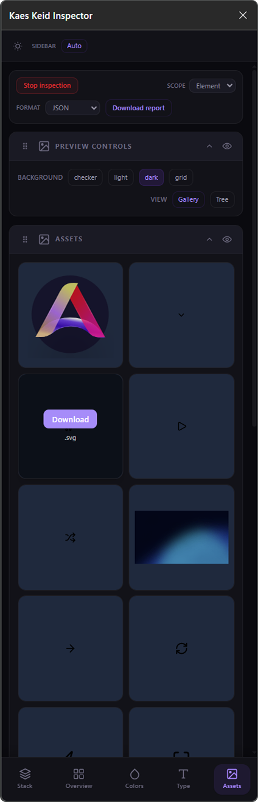
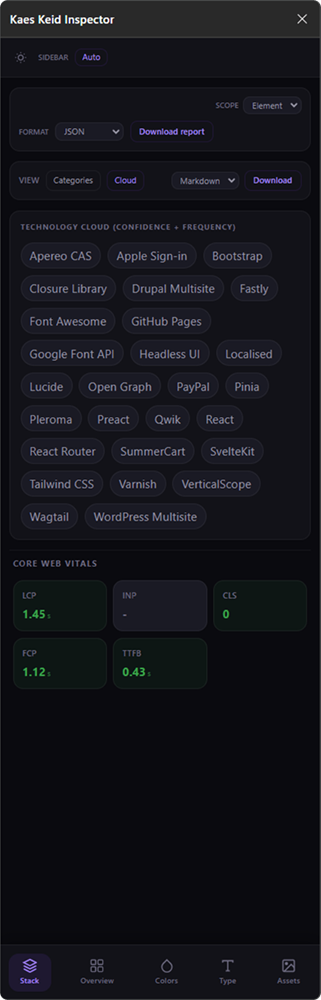

# Kaes Keid Inspector

**The definitive CSS/HTML & Technology Stack Inspector -- Free & Open Source.**

Kaes Keid is a Chrome/Edge browser extension that turns any website into an open book. Instantly inspect design properties, dissect color palettes, explore typography, check accessibility contrast, browse assets, and discover the entire technology stack powering any page -- all without leaving your browser.

No accounts. No subscriptions. No API keys. No premium tiers. Everything runs 100% locally.

---

## What It Does

### Technology Stack Analyzer
Automatically detects **90+ technologies** across 15 categories the moment you open the extension:
- **Frontend Frameworks** -- React, Next.js, Vue, Nuxt, Angular, Svelte, Astro, Remix, HTMX...
- **UI & Styling** -- Tailwind CSS, Bootstrap, Material UI, Chakra UI, Radix UI, Shadcn/ui...
- **CMS / Platforms** -- WordPress, Shopify, Webflow, Wix, Squarespace, Ghost, Drupal...
- **Backend / Server** -- Node.js, PHP, Ruby on Rails, Django, Laravel, ASP.NET
- **Databases & BaaS** -- Firebase, Supabase, MongoDB Realm, Prismic, Sanity
- **Analytics** -- Google Analytics, GTM, Hotjar, Mixpanel, Segment, PostHog, Clarity...
- **CDN & Infrastructure** -- Cloudflare, Vercel, Netlify, AWS CloudFront, jsDelivr...
- **Fonts** -- Google Fonts, Adobe Fonts, Font Awesome
- **APIs & Services** -- Google Maps, Mapbox, Algolia, Auth0, Clerk, Twilio...
- **Payment** -- Stripe, PayPal, Square
- And more: Error Tracking, Security, Marketing, Video...

Detection uses 6 signal types: script sources, meta tags, DOM selectors, cookies, CSS variables, and window globals (via injected web-accessible script).

### CSS & Design Inspector
Hover over any element to see a floating tooltip with key properties. Click to inspect in full detail:
- **Design Properties** -- Typography, colors, box model, borders, shadows, gradients, transitions, transforms, filters, backdrop-filter
- **Color Palette** -- Every unique color on the page with counts and categories. Copy or export.
- **Typography Explorer** -- All font styles grouped by family/size/weight with live preview
- **Asset Browser** -- Images, SVGs, and background images with direct download
- **Contrast Checker** -- WCAG contrast ratings (AAA/AA/Poor) for every inspected element

---

## Install

1. Download or clone this repo
2. Run `bun install && bun run build`
3. Open `chrome://extensions/` or `edge://extensions/`
4. Enable **Developer Mode**
5. Click **Load unpacked** and select the `dist/` folder
6. Click the Kaes Keid icon in your toolbar -- done!

---

## How It Works

1. **Open the extension** -- It starts on the **Stack** tab, immediately analyzing the page's technology fingerprint
2. **Switch to any other tab** (Overview, Colors, Type, Assets) -- The CSS Inspector activates automatically, enabling hover tooltips and element selection
3. **Switch back to Stack** -- The CSS Inspector stops cleanly, no interference with the page

---

## Screenshots

### Main Panel

### Inspector Overlay

### Category Views

| Overview | Colors |
| --- | --- |
|  |  |

| Typography | Assets | Stack |
| --- | --- | --- |
|  |  |  |

---

## Tech Stack (yes, we eat our own dogfood)

- **React 19 + TypeScript** -- Side panel UI
- **Tailwind CSS v4** -- Styling
- **Vite + @crxjs/vite-plugin** -- Manifest V3 build system
- **Shadow DOM** -- Overlay isolation (zero CSS leaks to host pages)
- **Bun** -- Package manager & script runner

---

## Contributing

Contributions are very welcome! Whether it is adding new technology fingerprints, improving the UI, or fixing bugs -- feel free to open issues or submit pull requests.

---

## Other Projects

Check out more of my work on [GitHub](https://github.com/mafhper) -- I build tools focused on productivity, design, and developer experience.

---

## License

MIT
